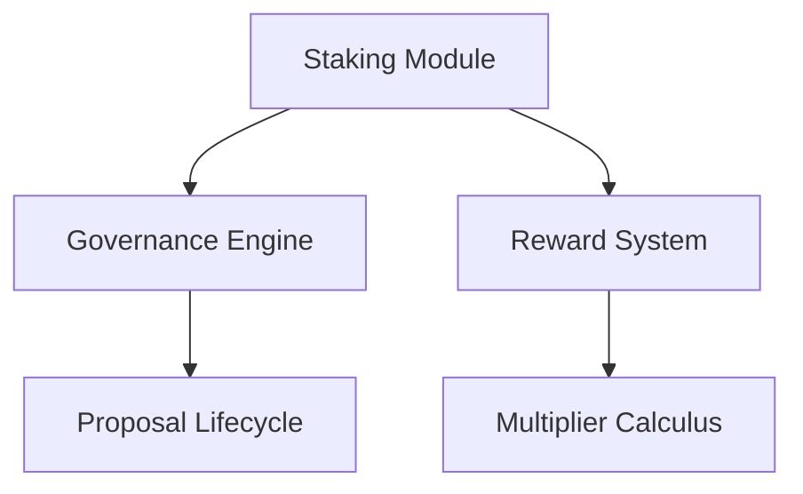

# Bitstack Protocol - Smart Contract Documentation

## Overview

Bitstack is a sophisticated decentralized data governance protocol built on Stacks L2 (Bitcoin Layer 2) that combines staking mechanics with decentralized decision-making. This smart contract enables three core functionalities:

1. **Tiered STX Staking System**
2. **On-chain Governance Mechanism**
3. **Reward Distribution Engine**

The protocol creates a circular economy where participants earn governance rights and rewards proportional to their stake duration and amount, while simultaneously governing the platform's evolution.

## Key Features

### 1. Multi-Tier Staking System

| Tier Level | Minimum STX | Multiplier | Features Enabled   |
| ---------- | ----------- | ---------- | ------------------ |
| Bronze (1) | 1,000,000µ  | 1x         | Basic Voting       |
| Silver (2) | 5,000,000µ  | 1.5x       | Enhanced Analytics |
| Gold (3)   | 10,000,000µ | 2x         | Premium Features   |

### 2. Time-Lock Boosters

```python
Lock Periods = {
    0 blocks: 1x multiplier,
    4320 (1 month): 1.25x,
    8640 (2 months): 1.5x
}
```

### 3. Governance Engine

- Proposal lifecycle management
- Quadratic voting weights
- Automated proposal execution
- Anti-sybil protections

## Smart Contract Architecture

### Core Components



### Data Structures

1. **User Positions**

```clarity
{
    total-collateral: uint,
    stx-staked: uint,
    voting-power: uint,
    tier-level: uint,
    rewards-multiplier: uint
}
```

2. **Proposal Structure**

```clarity
{
    creator: principal,
    description: string256,
    votes-for: uint,
    votes-against: uint,
    execution-status: bool
}
```

## Function Reference

### Staking Operations

#### `stake-stx`

```clarity
(define-public (stake-stx (amount uint) (lock-period uint))
```

- **Parameters:**
  - `amount`: Micro-STX to stake (minimum 1M µSTX)
  - `lock-period`: 0, 4320, or 8640 blocks
- **Errors:**
  - `ERR-BELOW-MINIMUM`: <1M µSTX
  - `ERR-INVALID-PROTOCOL`: Invalid lock period

#### `initiate-unstake`

```clarity
(define-public (initiate-unstake (amount uint))
```

- Triggers 24h cooldown
- Fails if existing cooldown active

### Governance Functions

#### `create-proposal`

```clarity
(define-public (create-proposal (desc string256) (voting-period uint))
```

- **Requirements:**
  - Minimum 1M voting power
  - 10-256 character description
  - Voting period 100-2880 blocks

#### `vote-on-proposal`

```clarity
(define-public (vote-on-proposal (proposal-id uint) (vote-for bool))
```

- Votes weighted by voting power
- Quadratic weighting planned for v2

### Administrative Functions

#### Emergency Controls

```clarity
(define-public (pause-contract))
(define-public (resume-contract))
```

- Contract owner only
- Disables critical operations when paused

## Reward Mechanics

### Calculation Formula

```
Rewards = (StakedAmount * BaseRate * Multiplier * BlocksStaked) / 14,400,000
```

Where:

- BaseRate = 5% (500 basis points)
- Multiplier = TierLevel \* LockMultiplier

### Vesting Schedule

- Rewards accrue block-by-block
- Claimable anytime
- Auto-compounding option (v2 roadmap)

## Security Model

### Protections

1. Cooldown-period enforced unstaking
2. Tier-based rate limiting
3. Multi-signature emergency controls
4. Time-locked governance actions

### Error Codes

| Code | Description                 |
| ---- | --------------------------- |
| 1000 | Unauthorized access         |
| 1001 | Invalid protocol parameters |
| 1002 | Incorrect amount specified  |
| 1003 | Insufficient funds          |
| 1004 | Cooldown period active      |

## Development Guide

### Requirements

- Clarinet v1.5+
- Node.js 16+
- Stacks.js SDK
